# KSRM College CMS — Production Data Model Design

**Status:** Phase 1 (additive schema) generated and verified. **Not applied to any database** (no live Postgres in this environment — see §9). No existing column was renamed, retyped, dropped, or backfilled. No application code (controllers/services/DTOs) was touched. Waiting for your approval before Phase 2 (data migration/backfill) or any implementation work begins.

**Scope:** the CMS content-management domain only — no students, courses, enrollment, attendance, exam results, or fees.
**Tenancy:** single-tenant (KSRM only). §8 documents the path to multi-tenancy without building it now.

This document has been revised after your Phase 1A approval to incorporate: the RBAC system-role seed list, the restricted (real-only) committee scope, the `Notification` → `TickerNotice` rename (documented, execution deferred), soft delete, optimistic locking, and the new `SiteSetting` entity. **The 100+ schema edge-case review you asked for is in the companion document `DATA_MODEL_EDGE_CASES.md`** (101 items, organized by category) rather than inline here, to keep each document navigable.

---

## 0. What Phase 1 actually generated

| File | What it is |
|---|---|
| `backend/prisma/schema.prisma` | The updated schema — every original field on the 9 pre-existing models kept exactly as it was; new tables and new nullable/defaulted columns added alongside them |
| `backend/prisma/migrations/20260704083958_phase1_additive_cms_data_model/migration.sql` | The generated migration SQL — verified to contain **zero** `DROP TABLE`, `DROP COLUMN`, `RENAME`, or `ALTER COLUMN ... TYPE` statements (checked by direct grep against the output, not just asserted — see §9) |
| `backend/prisma/seed.ts` | Extended (not replaced) to also seed the `Permission` catalog and the 9 system `Role`s with their permission mappings — the pre-existing super-admin seed logic is untouched. **No existing admin is assigned any role by this script.** |
| `backend/DATA_MODEL_EDGE_CASES.md` | The 101-item structured edge-case review |

**Verified, not assumed:** `npx prisma validate` passes; `npx prisma generate` succeeds; `npx tsc --noEmit` passes for both the application (`tsconfig.build.json`) and the whole project including the updated seed script (`tsconfig.json`) — confirming the regenerated Prisma Client doesn't break any existing NestJS code, since nothing in `src/` was changed. Full regression build/test results are in §11.

---

## 1. Design principles

1. **Every "department" (and "category") string in the current schema becomes a real foreign key**, added alongside — never replacing — the existing string column in Phase 1.
2. **Admin-manageable taxonomies get their own table, not a hardcoded string** (categories, programmes, learning outcomes, committee rosters).
3. **Genuinely fixed, small, code-meaningful vocabularies become Postgres enums.**
4. **History-sensitive records are denormalized snapshots, not live joins** (`AuditLog`, `CommitteeMember`).
5. **Nothing destructive happens to production data without an explicit, separate approval gate** — this is why Phase 1 is additive-only and why several items below are explicitly deferred rather than silently included.

---

## 2. Entity-relationship diagram

```mermaid
erDiagram
    DEPARTMENT ||--o{ FACULTY : "employs"
    DEPARTMENT |o--o| FACULTY : "hod (optional, 1:1)"
    DEPARTMENT ||--o{ LAB : has
    DEPARTMENT ||--o{ RESEARCH : has
    DEPARTMENT ||--o{ PLACEMENT : has
    DEPARTMENT ||--o{ DEGREE_VERIFICATION : has
    DEPARTMENT ||--o{ LEARNING_OUTCOME : has
    DEPARTMENT ||--o{ DEPARTMENT_PROGRAMME : has
    DEPARTMENT ||--o{ DEPARTMENT_HIGHLIGHT : has
    DEPARTMENT ||--o{ GALLERY_IMAGE : "optionally scopes"
    DEPARTMENT ||--o{ EXAM_NOTIFICATION : "optionally scopes"
    DEPARTMENT ||--o{ DOWNLOAD : "optionally scopes"
    DEPARTMENT ||--o{ ADMIN : "optionally scopes"

    FACULTY ||--o{ LAB : "in-charge of (optional)"
    FACULTY ||--o{ COMMITTEE_MEMBER : "may serve as (optional)"

    COMMITTEE ||--o{ COMMITTEE_MEMBER : has

    CATEGORY ||--o{ NEWS : categorizes
    CATEGORY ||--o{ GALLERY_IMAGE : categorizes
    CATEGORY ||--o{ EXAM_NOTIFICATION : categorizes
    CATEGORY ||--o{ DOWNLOAD : categorizes

    ADMIN ||--o{ NEWS : authors
    ADMIN ||--o{ ADMIN_ROLE : has
    ADMIN ||--o{ REFRESH_TOKEN : has
    ADMIN ||--o{ AUDIT_LOG : "performs (optional FK)"
    ADMIN ||--o{ SITE_SETTING : "last updated"

    ROLE ||--o{ ADMIN_ROLE : has
    ROLE ||--o{ ROLE_PERMISSION : has
    PERMISSION ||--o{ ROLE_PERMISSION : has

    DEPARTMENT {
        int id PK
        string slug UK
        string name
        int hodId FK "nullable, unique"
        datetime deletedAt "soft delete"
        int version "optimistic lock"
    }
    FACULTY {
        int id PK
        int departmentId FK "nullable in Phase 1"
        string name
        string designation
        datetime deletedAt "soft delete"
        int version "optimistic lock"
    }
    LAB {
        int id PK
        int departmentId FK
        int inChargeFacultyId FK "nullable"
        datetime deletedAt "soft delete"
    }
    COMMITTEE {
        int id PK
        enum type "ANTI_RAGGING | GRIEVANCE_REDRESSAL | OTHER"
        string name
        datetime deletedAt "soft delete"
    }
    COMMITTEE_MEMBER {
        int id PK
        int committeeId FK
        int facultyId FK "nullable"
        string name "snapshot"
        datetime deletedAt "soft delete"
    }
    CATEGORY {
        int id PK
        enum domain
        string slug
    }
    DOWNLOAD {
        int id PK
        int departmentId FK "nullable"
        enum category
        datetime deletedAt "soft delete"
    }
    NEWS {
        int id PK
        string slug UK "nullable in Phase 1"
        int categoryId FK "nullable"
        int authorAdminId FK "nullable"
        datetime deletedAt "soft delete"
        int version "optimistic lock"
    }
    PLACEMENT {
        int id PK
        int departmentId FK "nullable"
        datetime deletedAt "soft delete"
    }
    ADMIN {
        int id PK
        string email UK
        int departmentId FK "nullable"
        bool isSuperAdmin
    }
    PERMISSION {
        int id PK
        string key UK
    }
    ROLE {
        int id PK
        string name UK
        bool isSystemRole
    }
    REFRESH_TOKEN {
        int id PK
        int adminId FK
        string tokenHash UK
    }
    SITE_SETTING {
        int id PK
        string key UK
        string value
        enum type
        string group
        bool isPublic
    }
```

*(Full field list for every entity, including ones abbreviated above for diagram legibility, is in §3.)*

---

## 3. Entity catalog

### 3.1 `Department`

| Field | Type | Notes |
|---|---|---|
| `id` | `Int` PK | |
| `slug` | `String` **unique** | |
| `name` | `String` | |
| `shortName` | `String?` | |
| `tagline` | `String?` | |
| `intro` | `String?` | |
| `about` | `String` | |
| `aboutVideoUrl` | `String?` | |
| `heroImageUrl` | `String?` | |
| `vision` | `String?` | |
| `mission` | `String[]` | |
| `establishedYear` | `Int?` | |
| `hodId` | `Int?` **unique**, FK → `Faculty.id`, `SetNull` | |
| `isActive` | `Boolean` default `true` | |
| `createdAt`/`updatedAt` | `DateTime` | |
| `deletedAt` | `DateTime?` | soft delete (see §5) |
| `deletedBy` | `Int?` FK → `Admin`, `SetNull` | |
| `version` | `Int` default `1` | optimistic locking (see §6) |

### 3.2 `LearningOutcome`, `DepartmentProgramme`, `DepartmentHighlight`

All three: `id`, `departmentId` FK → `Department` (`Cascade`), plus their distinguishing fields, plus `deletedAt`/`deletedBy`/`version` (all three are "department content," in the approved soft-delete scope).

- `LearningOutcome`: `type: OutcomeType` (PEO/PO/PSO), `code`, `title?`, `text`, `sortOrder`. `@@unique([departmentId, type, code])`.
- `DepartmentProgramme`: `name`, `level: ProgrammeLevel` (UG/PG/PHD/DIPLOMA), `intake: Int`, `sortOrder`, `isActive`.
- `DepartmentHighlight`: `title`, `description`, `sortOrder`, `isActive`.

### 3.3 `Faculty`

Unchanged existing fields: `id`, `name`, `designation` (**kept free-text per your decision — not converted to an enum**), `qualification`, `department` (string, untouched), `specialization?`, `experience?`, `email?` (**not made unique in Phase 1** — see `DATA_MODEL_EDGE_CASES.md` #20), `photoUrl?`, `isHod` (untouched — `Department.hodId` is the new source of truth, `isHod` itself is left alone until cutover), `isActive`, `createdAt`/`updatedAt`.

New in Phase 1: `departmentId Int?` (FK → `Department`, `SetNull`), `welcomeMessage String?` (HOD-only content), `sortOrder Int @default(0)`, `deletedAt`/`deletedBy`/`version`.

### 3.4 `Lab` (new table)

`id`, `departmentId` FK → `Department` (`Cascade`), `name`, `description`, `imageUrl?`, `capacity?`, `inChargeFacultyId?` FK → `Faculty` (`SetNull`), `sortOrder`, `isActive`, `deletedAt`/`deletedBy`/`version`.

### 3.5 `Research`

Unchanged existing fields kept as-is, including `type: String` (**not converted to an enum in Phase 1** — deferred, see §7). New: `departmentId Int?` (FK, `SetNull`), `doiOrLink String?`, `updatedAt` (new — didn't exist before). **Deliberately not given soft-delete columns** — not in your approved soft-delete scope list; `isActive` already serves as its show/hide toggle.

### 3.6 `Committee` / `CommitteeMember`

**`CommitteeType` enum restricted to `ANTI_RAGGING`, `GRIEVANCE_REDRESSAL`, `OTHER`** — per your instruction, no `WOMENS_CELL`/`SCST_CELL` values, since only Anti-Ragging and Grievance Redressal actually exist on the site today. `OTHER` remains as the escape hatch for a real future committee, without pre-inventing one.

**`Committee`**: `id`, `name`, `type: CommitteeType`, `description?`, `isActive`, `deletedAt`/`deletedBy`/`version`. `@@unique([type, name])`.

**`CommitteeMember`**: `id`, `committeeId` FK → `Committee` (`Cascade`), `facultyId?` FK → `Faculty` (`SetNull`), `name` (snapshot), `designation` (snapshot), `role` (their role *in the committee*), `sortOrder`, `isActive`, `deletedAt`/`deletedBy`/`version`.

### 3.7 `Category`

`id`, `domain: CategoryDomain` (NEWS/GALLERY/EXAM_NOTIFICATION/DOWNLOAD), `name`, `slug`, `sortOrder`, `isActive`, `createdAt`. `@@unique([domain, slug])`. **Not soft-deletable** — a lookup/taxonomy table, not "content."

### 3.8 `Download` (new table)

`id`, `title`, `description?`, `category: DownloadCategory`, `departmentId?` FK → `Department` (`SetNull`), `categoryId?` FK → `Category` (`SetNull`), `fileUrl`, `sortOrder`, `isActive`, `publishedAt`, `deletedAt`/`deletedBy`/`version`.

*(Note: `Download` carries both a `category` enum and a `categoryId` → `Category` FK — an intentional overlap flagged as a design smell to resolve before Phase 6; see `DATA_MODEL_EDGE_CASES.md` #12/#78.)*

### 3.9 `News`

Unchanged existing fields kept as-is (`title`, `content`, `category: String`, `imageUrl?`, `date`, `isPublished`, `createdAt`/`updatedAt`). New: `slug String? @unique` (nullable — safe to add since Postgres allows unlimited `NULL`s under a unique constraint), `categoryId?` FK → `Category` (`SetNull`), `authorAdminId?` FK → `Admin` (`SetNull`), `deletedAt`/`deletedBy`/`version`.

### 3.10 `GalleryImage`

Unchanged existing fields kept as-is. New: `categoryId?` FK (`SetNull`), `departmentId?` FK (`SetNull`), `sortOrder Int @default(0)`, `deletedAt`/`deletedBy`/`version`.

### 3.11 `Notification` — **rename to `TickerNotice` approved, execution deferred**

Per your instruction, `Notification` → `TickerNotice` is the approved target name. **It is not executed in Phase 1.** A naive Prisma schema-diff rename is a `DROP TABLE` + `CREATE TABLE`, not an `ALTER TABLE ... RENAME`, and would destroy any existing data in that table. The rename will happen in its own later, hand-written migration that uses a real `RENAME TO`, once we're past the additive-only phase. The model stays named `Notification` in `schema.prisma` for now.

Unchanged existing fields kept as-is. New: `startsAt?`, `endsAt?`, `sortOrder Int @default(0)`. **No soft-delete/version added** — not in your approved soft-delete scope list.

### 3.12 `ExamNotification`

Unchanged existing fields kept as-is, including `category: String` and `date`. New: `categoryId?` FK (`SetNull`), `departmentId?` FK (`SetNull`), `updatedAt` (new). **Not soft-deletable** — not in scope list.

### 3.13 `Placement`

Unchanged existing fields kept as-is, including `package: String` (**not converted to `Decimal` in Phase 1** — that's an existing-column type change, deferred to cutover per the "no destructive migrations" rule). New: `departmentId?` FK (`SetNull`), `companyLogoUrl?`, `isPublished Boolean @default(true)`, `updatedAt` (new), `deletedAt`/`deletedBy`/`version`.

### 3.14 `DegreeVerification`

Unchanged existing fields kept as-is, including `degree: String` (not yet an enum — deferred alongside `Research.type`, same reasoning). New: `departmentId?` FK (`SetNull`), `cgpaOrPercentage Decimal? @db.Decimal(5,2)`, `updatedAt` (new). **Not soft-deletable** — not in scope list (this is arguably a record that should never be deleted at all, soft or hard — worth revisiting).

### 3.15 `Admin`

Unchanged existing fields kept as-is, including `permissions: String[]` and `department: String?` (**both untouched in Phase 1** — the new RBAC tables and `departmentId` FK are added *alongside*, not instead of, these). New: `departmentId? ` FK → `Department` (`SetNull`), `lastLoginAt?`.

Plus the full set of reverse relations needed for every `deletedBy`/`authorAdminId`/`updatedBy` FK elsewhere in the schema (17 array fields — see the actual `schema.prisma` for the complete list; `Admin` is structurally a "hub" model and this is an unavoidable, correct consequence of giving every soft-delete/attribution field a real FK rather than a bare untyped integer).

### 3.16 RBAC: `Permission`, `Role`, `RolePermission`, `AdminRole` — **now seeded, not just designed**

**13 permissions** (see `prisma/seed.ts` for the authoritative list): `faculty.manage`, `departments.manage` (covers Department + Lab + LearningOutcome + Programme + Highlight as one bundle), `news.manage`, `gallery.manage`, `placements.manage`, `exam_notifications.manage`, `notifications.manage`, `research.manage`, `degree_verification.manage`, `downloads.manage`, `committees.manage`, `admins.manage`, `site_settings.manage`.

**9 system roles**, per your list, with a proposed default permission mapping (a starting point for your review — see `DATA_MODEL_EDGE_CASES.md` #81-85 for the caveats on this mapping):

| Role | Permissions |
|---|---|
| Super Admin | All 13 (cosmetic/documentational — actual bypass is still `Admin.isSuperAdmin`, unrelated to this role; see edge case #83) |
| CMS Administrator | All 12 content permissions (everything except `admins.manage`) |
| Department Administrator | `departments.manage`, `faculty.manage` |
| Department Editor | `departments.manage` only |
| Faculty Manager | `faculty.manage` only (institution-wide, not department-scoped) |
| Placements Officer | `placements.manage` |
| Examination Cell | `exam_notifications.manage` |
| Content Editor | `news.manage`, `gallery.manage`, `notifications.manage` |
| Viewer | none (read-only via existing public GET endpoints) |

All 9 roles are seeded with `isSystemRole: true`. **No existing admin is assigned any of these roles by the seed script** — that assignment is Phase 5 (§9), an explicit, separate, reviewed data migration.

### 3.17 `RefreshToken`

Unchanged from the original proposal: `id`, `adminId` FK → `Admin` (`Cascade`), `tokenHash` **unique** (a hash, never the raw token), `expiresAt`, `revokedAt?`, `createdByIp?`, `userAgent?`, `createdAt`. **Schema only, per your decision** — no refresh-token auth flow is implemented; the existing single 7-day JWT login is completely unchanged.

### 3.18 `AuditLog`

Unchanged existing fields kept as-is, including the plain `adminId: Int` (no FK) and `action: String`. New: `adminRefId Int?`, a **separate, new, nullable** FK → `Admin` (`SetNull`) — deliberately not added as a constraint on the existing `adminId` column itself, since that could fail if any existing row's `adminId` doesn't correspond to a real `Admin.id` (unverified against live data). `action` is not converted to the planned `AuditAction` enum in Phase 1, for the same reason.

### 3.19 `SiteSetting` (new table)

Exact fields as you specified: `id`, `key` **unique**, `value: String`, `type: SiteSettingType`, `group: String`, `isPublic: Boolean`, `description?`, `createdAt`/`updatedAt`. **One addition beyond your list, flagged for your review:** `updatedBy Int?` (FK → `Admin`, `SetNull`) — an accountability trail for who last changed a setting. No soft-delete/versioning — this is system configuration, not "content."

`SiteSettingType` enum: `STRING`, `NUMBER`, `BOOLEAN`, `JSON`, `URL`, `EMAIL`, `IMAGE_URL`.

---

## 4. Enum catalog (Phase 1)

| Enum | Values | Used by |
|---|---|---|
| `OutcomeType` | `PEO`, `PO`, `PSO` | `LearningOutcome.type` |
| `ProgrammeLevel` | `UG`, `PG`, `PHD`, `DIPLOMA` | `DepartmentProgramme.level` |
| `CommitteeType` | `ANTI_RAGGING`, `GRIEVANCE_REDRESSAL`, `OTHER` | `Committee.type` |
| `CategoryDomain` | `NEWS`, `GALLERY`, `EXAM_NOTIFICATION`, `DOWNLOAD` | `Category.domain` |
| `DownloadCategory` | `SYLLABUS`, `QUESTION_PAPER`, `BROCHURE`, `AFFIDAVIT`, `FORM`, `OTHER` | `Download.category` |
| `SiteSettingType` | `STRING`, `NUMBER`, `BOOLEAN`, `JSON`, `URL`, `EMAIL`, `IMAGE_URL` | `SiteSetting.type` |

**Deferred to a later phase** (not created in Phase 1 — see §7): `ResearchType`, `DegreeType`, `AuditAction`.

---

## 5. Soft delete — scope and mechanism

**Gets `deletedAt`/`deletedBy`/`version`** (per your explicit list, mapped onto the full entity catalog): `Faculty`, `Lab`, `News`, `GalleryImage`, `Download`, `Placement`, `Committee`, `CommitteeMember` (extension of "Committees" — see edge case #58 for the reasoning), `Department`, `LearningOutcome`, `DepartmentProgramme`, `DepartmentHighlight` ("Department content").

**Stays hard-deleted** (not in your list): `Research`, `Notification`, `ExamNotification`, `DegreeVerification`, `Category`, `Admin` (already has its own `isActive` deactivation mechanism — see edge case #57 for why this is a *different* mechanism, not a gap), `Permission`, `Role`, `RolePermission`, `AdminRole`, `RefreshToken` (has its own `revokedAt` mechanism instead — a different lifecycle entirely), `AuditLog` (append-only, never deleted at all), `SiteSetting`.

**Mechanism:** a nullable `deletedAt: DateTime?` — `null` means "not deleted"; any timestamp means "deleted at that moment." `deletedBy: Int?` records who (nullable, since a system/scripted deletion may have no acting admin). **Important limitation, not a bug:** soft-delete is implemented as a plain `UPDATE`, which means every `onDelete` rule in §3/§6 (Cascade/SetNull/Restrict) — which only fires on a real SQL `DELETE` — does **not** apply to it at all. Soft-deleting a `Department` does not cascade to, or get blocked by, its Faculty/Labs at the database level; that behavior has to be built explicitly in application code in Phase 6. This is the most important single caveat in this whole document for whoever implements it — see `DATA_MODEL_EDGE_CASES.md` §F for the full list of soft-delete-specific gotchas (unique constraints not being released by a soft-delete, no automatic query filtering, etc.).

---

## 6. Optimistic locking — mechanism

**Scope:** the same 12 entities as soft-delete (§5) — "editable content."

**Mechanism:** `version: Int @default(1)`. An update must be issued as `UPDATE ... SET ..., version = version + 1 WHERE id = ? AND version = ?` (in Prisma: `prisma.faculty.update({ where: { id, version: expectedVersion }, data: { ..., version: { increment: 1 } } })`). If another admin updated the row in between, the `WHERE` clause matches zero rows and Prisma throws `P2025` ("record not found") — **the application must catch this specific case and distinguish it from a genuine 404** (the ID truly not existing), since Prisma's error alone doesn't tell you which happened; that requires a separate existence check. On a real conflict, the correct response is `409 Conflict` with a "this record was changed by someone else, please refresh" message — not implemented yet (Phase 6), but this is the exact mechanism it will use.

**Not implemented in Phase 1:** any actual update logic. The `version` column exists and is ready; nothing in the current NestJS services reads or increments it yet, consistent with "no application code" for this phase.

---

## 7. Deferred out of Phase 1 (explicit list)

Everything below was considered and intentionally **not** done now, because each would touch an *existing* column/table in a way that isn't purely additive:

1. **`Notification` → `TickerNotice` rename** — needs a hand-written `ALTER TABLE ... RENAME TO ...`, not a schema-diff-generated `DROP`+`CREATE`. (§3.11)
2. **`Research.type: String` → `ResearchType` enum** — changing an existing column's type. (§3.5)
3. **`DegreeVerification.degree: String` → `DegreeType` enum** — same reasoning.
4. **`AuditLog.action: String` → `AuditAction` enum** — same reasoning.
5. **`AuditLog.adminId` gaining a real FK constraint** — could fail if any existing row's value doesn't correspond to a real `Admin.id`, which hasn't been checked against live data. A new, separate, nullable `adminRefId` column was added instead (§3.18).
6. **`Placement.package: String` → `Decimal`** — existing column type change.
7. **`Faculty.email` gaining a `@unique` constraint** — could fail if duplicate emails already exist in live data; not checked.
8. **Any backfilling of the new nullable FK columns** — that's Phase 2/3 (§9), a reviewed script run against real data, not part of this migration.
9. **Assigning any of the 9 seeded roles to any existing admin** — Phase 5 (§9), an explicit product decision (per-admin mapping vs. rationalized roles — you flagged this as needing its own review in the original open questions).
10. **Dropping `Faculty.isHod`, the old string `department`/`category` columns, `Admin.permissions`** — Phase 7 (§9), the one phase with no clean rollback, gated last on purpose.

---

## 8. Multi-tenancy readiness (unchanged from original — documented path only, nothing built)

No `tenantId`/`institutionId` column exists anywhere in this design. If the degree-verification-as-SaaS idea is ever pursued: a new `Institution` entity, every table gaining a nullable-then-required `institutionId`, every currently-global unique constraint becoming composite-scoped by institution, and — the largest real cost — every application-layer query gaining a mandatory tenant filter. None of this is built now; see the original design rationale for the full breakdown.

---

## 9. Migration strategy — where Phase 1 sits in the full plan

**Phase 1 (this migration) — additive schema only.** ✅ Generated: 15 new tables, 6 new enums, additive nullable/defaulted columns on 9 existing tables, 55 new indexes, 40 new FK constraints — all verified to contain zero destructive statements (§0). RBAC catalog (`Permission`/`Role`/`RolePermission`) seeded via `prisma/seed.ts`, not assigned to any existing admin.

**Phase 2 — Data backfill (not started).** Resolve each existing string `department`/`category` value to its matching new `Department`/`Category` row (once those reference rows are themselves seeded from real distinct values actually in the data — not assumed here) and populate the new FK columns. A reviewed script, run against a staging copy first.

**Phase 3 — Verify.** Confirm every row's new FK column is populated (`COUNT(*) WHERE newColumn IS NULL` == 0) before proceeding.

**Phase 4 — Constrain.** Make the new FK columns `NOT NULL`, tighten `SetNull` to `Restrict` where §3 specifies it, add the deferred enum conversions (§7 items 2-4), add the `Faculty.email` unique constraint (after a duplicate check), add the `AuditLog.adminId`→`adminRefId` FK properly (after verifying no orphaned values).

**Phase 5 — RBAC data migration.** Map existing admins' `permissions: String[]` values onto the seeded roles (or new ones) — an explicit, reviewed, separate step; not a byproduct of Phase 1's seeding.

**Phase 6 — Application code cutover.** Every NestJS service/controller/DTO updated to use the new relations, implement soft-delete filtering and cascade/block policy, implement optimistic-locking conflict handling, build the `SiteSetting` and RBAC admin UI/API. **Entirely out of scope until you approve the schema through Phase 4.**

**Phase 7 — Cleanup (irreversible, isolated last).** Drop `Faculty.isHod`, the old string columns, `Admin.permissions`, execute the `Notification`→`TickerNotice` rename.

**Rollback posture for Phase 1 specifically:** trivial. Every new table can be dropped, every new column removed, every new enum type dropped — nothing existing was touched, so there is no data to lose in a Phase 1 rollback.

**What was NOT verified (environment constraint, consistent with the rest of this engagement):** this migration was generated via an offline schema-to-schema diff (`prisma migrate diff --from-schema-datamodel --to-schema-datamodel`), which does not require or touch a live database. It has **not** been applied to, or tested against, a real running Postgres instance with actual data in it — no live database has been available throughout this engagement. The SQL is correct relative to the two schema files (verified by direct inspection of every statement, §0), but end-to-end execution against a real database is unverified.

---

## 10. Resolved decisions (was "open questions" — now closed per your Phase 1A approval)

1. **`Faculty.designation`** — stays free-text. ✅ Decided.
2. **RefreshToken / short-lived access tokens** — `RefreshToken` schema added; auth flow unchanged. ✅ Decided.
3. **RBAC data migration mapping** — deferred to its own Phase 5 review; system roles seeded now with a proposed mapping (§3.16) for you to review before that phase. Not yet decided which existing-admin mapping approach to use.
4. **Committee seed data** — restricted to real committees only (Anti-Ragging, Grievance Redressal). ✅ Decided.
5. **Naming** — `Notification` → `TickerNotice` approved; execution deferred (§3.11, §7). ✅ Decided (rename itself), execution pending.

## 11. Regression verification performed

- `npx prisma validate` — clean.
- `npx prisma generate` — clean, Prisma Client regenerated successfully.
- `npx tsc -p tsconfig.build.json --noEmit` (application code) — clean, zero errors against the regenerated client.
- `npx tsc -p tsconfig.json --noEmit` (whole project, including the updated `prisma/seed.ts`) — clean.
- Full existing unit + e2e test suites (`npx jest`, `npx jest --config ./test/jest-e2e.json`) and `nest build` — see the final report for this session for pass/fail confirmation; run after this document was written, as the last verification step before considering Phase 1 complete.

---

## 12. What happens next

Nothing beyond Phase 1 — until you review this update and `DATA_MODEL_EDGE_CASES.md` and tell me how to proceed on Phase 2 (data backfill). No data migration, no backfill, no application code, no further schema changes without your explicit go-ahead.
