# KSRM College CMS — Production Data Model Design

**Status:** Phase 1 + Phase 1B (both additive schema only) generated and verified. **Not applied to any database** (no live Postgres in this environment — see §9). No existing column was renamed, retyped, dropped, or backfilled. No application code (controllers/services/DTOs) was touched. Waiting for your approval before data migration/backfill or any implementation work begins.

**Scope:** the CMS content-management domain only — no students, courses, enrollment, attendance, exam results, or fees.
**Tenancy:** single-tenant (KSRM only). §8 documents the path to multi-tenancy without building it now.

This document has been revised twice since the original design:
- **Phase 1A approval:** the RBAC system-role seed list, the restricted (real-only) committee scope, the `Notification` → `TickerNotice` rename (documented, execution deferred), soft delete, optimistic locking, and the new `SiteSetting` entity.
- **Phase 1B (this revision):** a systematic page-by-page audit of the entire frontend (§13) driving 10 new content entities so nothing on the site requires a developer to change hardcoded content; and a full RBAC redesign from one coarse `.manage` permission per module to real `module.action` granularity (§14, §3.16), per the explicit instruction that authorization must be permission-based, not role-based.

**The 100+ schema edge-case review is in the companion document `DATA_MODEL_EDGE_CASES.md`** (now 122 items, organized by category) rather than inline here, to keep each document navigable.

---

## 0. What Phase 1 + Phase 1B actually generated

| File | What it is |
|---|---|
| `backend/prisma/schema.prisma` | The updated schema — every original field on the 9 pre-existing models kept exactly as it was; new tables and new nullable/defaulted columns added alongside them |
| `backend/prisma/migrations/20260704083958_phase1_additive_cms_data_model/migration.sql` | Phase 1's migration SQL — 15 tables, 6 enums, additive columns on 9 existing tables |
| `backend/prisma/migrations/20260706065815_phase1b_page_driven_content_and_rbac_granularity/migration.sql` | Phase 1B's migration SQL — 10 more tables, 3 additive columns on `Department` (SEO fields). No enums added. |
| `backend/prisma/seed.ts` | Extended (not replaced) across both phases to seed a `Permission` catalog and the 9 system `Role`s — the pre-existing super-admin seed logic is untouched. **No existing admin is assigned any role by this script.** |
| `backend/DATA_MODEL_EDGE_CASES.md` | The structured edge-case review — 101 items from Phase 1, 21 more added in Phase 1B (122 total) |

Both migrations were independently verified to contain **zero** `DROP TABLE`, `DROP COLUMN`, `RENAME`, or `ALTER COLUMN ... TYPE` statements (checked by direct grep against each migration's output, not just asserted — see §9).

**Verified, not assumed:** `npx prisma validate` passes; `npx prisma generate` succeeds; `npx tsc --noEmit` passes for both the application (`tsconfig.build.json`) and the whole project including the updated seed script (`tsconfig.json`) — confirming the regenerated Prisma Client doesn't break any existing NestJS code, since nothing in `src/` was changed, after **both** migrations. Full regression build/test results are in §11.

---

## 1. Design principles

1. **Every "department" (and "category") string in the current schema becomes a real foreign key**, added alongside — never replacing — the existing string column in Phase 1.
2. **Admin-manageable taxonomies get their own table, not a hardcoded string** (categories, programmes, learning outcomes, committee rosters).
3. **Genuinely fixed, small, code-meaningful vocabularies become Postgres enums.**
4. **History-sensitive records are denormalized snapshots, not live joins** (`AuditLog`, `CommitteeMember`).
5. **Nothing destructive happens to production data without an explicit, separate approval gate** — this is why Phase 1 is additive-only and why several items below are explicitly deferred rather than silently included.

---

## 2. Entity-relationship diagram

```mermaid
erDiagram
    DEPARTMENT ||--o{ FACULTY : "employs"
    DEPARTMENT |o--o| FACULTY : "hod (optional, 1:1)"
    DEPARTMENT ||--o{ LAB : has
    DEPARTMENT ||--o{ RESEARCH : has
    DEPARTMENT ||--o{ PLACEMENT : has
    DEPARTMENT ||--o{ LEARNING_OUTCOME : has
    DEPARTMENT ||--o{ DEPARTMENT_PROGRAMME : has
    DEPARTMENT ||--o{ DEPARTMENT_HIGHLIGHT : has
    DEPARTMENT ||--o{ GALLERY_IMAGE : "optionally scopes"
    DEPARTMENT ||--o{ EXAM_NOTIFICATION : "optionally scopes"
    DEPARTMENT ||--o{ DOWNLOAD : "optionally scopes"
    DEPARTMENT ||--o{ ADMIN : "optionally scopes"

    FACULTY ||--o{ LAB : "in-charge of (optional)"
    FACULTY ||--o{ COMMITTEE_MEMBER : "may serve as (optional)"

    COMMITTEE ||--o{ COMMITTEE_MEMBER : has

    CATEGORY ||--o{ NEWS : categorizes
    CATEGORY ||--o{ GALLERY_IMAGE : categorizes
    CATEGORY ||--o{ EXAM_NOTIFICATION : categorizes
    CATEGORY ||--o{ DOWNLOAD : categorizes

    ADMIN ||--o{ NEWS : authors
    ADMIN ||--o{ ADMIN_ROLE : has
    ADMIN ||--o{ REFRESH_TOKEN : has
    ADMIN ||--o{ AUDIT_LOG : "performs (optional FK)"
    ADMIN ||--o{ SITE_SETTING : "last updated"

    ROLE ||--o{ ADMIN_ROLE : has
    ROLE ||--o{ ROLE_PERMISSION : has
    PERMISSION ||--o{ ROLE_PERMISSION : has

    DEPARTMENT {
        int id PK
        string slug UK
        string name
        int hodId FK "nullable, unique"
        datetime deletedAt "soft delete"
        int version "optimistic lock"
    }
    FACULTY {
        int id PK
        int departmentId FK "nullable in Phase 1"
        string name
        string designation
        datetime deletedAt "soft delete"
        int version "optimistic lock"
    }
    LAB {
        int id PK
        int departmentId FK
        int inChargeFacultyId FK "nullable"
        datetime deletedAt "soft delete"
    }
    COMMITTEE {
        int id PK
        enum type "ANTI_RAGGING | GRIEVANCE_REDRESSAL | OTHER"
        string name
        datetime deletedAt "soft delete"
    }
    COMMITTEE_MEMBER {
        int id PK
        int committeeId FK
        int facultyId FK "nullable"
        string name "snapshot"
        datetime deletedAt "soft delete"
    }
    CATEGORY {
        int id PK
        enum domain
        string slug
    }
    DOWNLOAD {
        int id PK
        int departmentId FK "nullable"
        enum category
        datetime deletedAt "soft delete"
    }
    NEWS {
        int id PK
        string slug UK "nullable in Phase 1"
        int categoryId FK "nullable"
        int authorAdminId FK "nullable"
        datetime deletedAt "soft delete"
        int version "optimistic lock"
    }
    PLACEMENT {
        int id PK
        int departmentId FK "nullable"
        datetime deletedAt "soft delete"
    }
    ADMIN {
        int id PK
        string email UK
        int departmentId FK "nullable"
        bool isSuperAdmin
    }
    PERMISSION {
        int id PK
        string key UK
    }
    ROLE {
        int id PK
        string name UK
        bool isSystemRole
    }
    REFRESH_TOKEN {
        int id PK
        int adminId FK
        string tokenHash UK
    }
    SITE_SETTING {
        int id PK
        string key UK
        string value
        enum type
        string group
        bool isPublic
    }
```

*(Full field list for every entity, including ones abbreviated above for diagram legibility, is in §3. The 10 Phase 1B page-driven content entities — `PageBanner`, `SiteStatistic`, `ContactChannel`, `Testimonial`, `CampusVideo`, `AccreditationBadge`, `Recruiter`, `Faq`, `LeadershipProfile`, `ContentCard` — are deliberately left off this diagram to keep it legible; none of them relate to each other or to the rest of the schema beyond the standard `deletedBy → Admin` pattern every soft-deletable entity has. Full detail in §13.)*

---

## 3. Entity catalog

### 3.1 `Department`

| Field | Type | Notes |
|---|---|---|
| `id` | `Int` PK | |
| `slug` | `String` **unique** | |
| `name` | `String` | |
| `shortName` | `String?` | |
| `tagline` | `String?` | |
| `intro` | `String?` | |
| `about` | `String` | |
| `aboutVideoUrl` | `String?` | |
| `heroImageUrl` | `String?` | |
| `vision` | `String?` | |
| `mission` | `String[]` | |
| `establishedYear` | `Int?` | |
| `hodId` | `Int?` **unique**, FK → `Faculty.id`, `SetNull` | |
| `isActive` | `Boolean` default `true` | |
| `createdAt`/`updatedAt` | `DateTime` | |
| `deletedAt` | `DateTime?` | soft delete (see §5) |
| `deletedBy` | `Int?` FK → `Admin`, `SetNull` | |
| `version` | `Int` default `1` | optimistic locking (see §6) |

### 3.2 `LearningOutcome`, `DepartmentProgramme`, `DepartmentHighlight`

All three: `id`, `departmentId` FK → `Department` (`Cascade`), plus their distinguishing fields, plus `deletedAt`/`deletedBy`/`version` (all three are "department content," in the approved soft-delete scope).

- `LearningOutcome`: `type: OutcomeType` (PEO/PO/PSO), `code`, `title?`, `text`, `sortOrder`. `@@unique([departmentId, type, code])`.
- `DepartmentProgramme`: `name`, `level: ProgrammeLevel` (UG/PG/PHD/DIPLOMA), `intake: Int`, `sortOrder`, `isActive`.
- `DepartmentHighlight`: `title`, `description`, `sortOrder`, `isActive`.

### 3.3 `Faculty`

Unchanged existing fields: `id`, `name`, `designation` (**kept free-text per your decision — not converted to an enum**), `qualification`, `department` (string, untouched), `specialization?`, `experience?`, `email?` (**not made unique in Phase 1** — see `DATA_MODEL_EDGE_CASES.md` #20), `photoUrl?`, `isHod` (untouched — `Department.hodId` is the new source of truth, `isHod` itself is left alone until cutover), `isActive`, `createdAt`/`updatedAt`.

New in Phase 1: `departmentId Int?` (FK → `Department`, `SetNull`), `welcomeMessage String?` (HOD-only content), `sortOrder Int @default(0)`, `deletedAt`/`deletedBy`/`version`.

### 3.4 `Lab` (new table)

`id`, `departmentId` FK → `Department` (`Cascade`), `name`, `description`, `imageUrl?`, `capacity?`, `inChargeFacultyId?` FK → `Faculty` (`SetNull`), `sortOrder`, `isActive`, `deletedAt`/`deletedBy`/`version`.

### 3.5 `Research`

Unchanged existing fields kept as-is, including `type: String` (**not converted to an enum in Phase 1** — deferred, see §7). New: `departmentId Int?` (FK, `SetNull`), `doiOrLink String?`, `updatedAt` (new — didn't exist before). **Deliberately not given soft-delete columns** — not in your approved soft-delete scope list; `isActive` already serves as its show/hide toggle.

### 3.6 `Committee` / `CommitteeMember`

**`CommitteeType` enum restricted to `ANTI_RAGGING`, `GRIEVANCE_REDRESSAL`, `OTHER`** — per your instruction, no `WOMENS_CELL`/`SCST_CELL` values, since only Anti-Ragging and Grievance Redressal actually exist on the site today. `OTHER` remains as the escape hatch for a real future committee, without pre-inventing one.

**`Committee`**: `id`, `name`, `type: CommitteeType`, `description?`, `isActive`, `deletedAt`/`deletedBy`/`version`. `@@unique([type, name])`.

**`CommitteeMember`**: `id`, `committeeId` FK → `Committee` (`Cascade`), `facultyId?` FK → `Faculty` (`SetNull`), `name` (snapshot), `designation` (snapshot), `role` (their role *in the committee*), `sortOrder`, `isActive`, `deletedAt`/`deletedBy`/`version`.

### 3.7 `Category`

`id`, `domain: CategoryDomain` (NEWS/GALLERY/EXAM_NOTIFICATION/DOWNLOAD), `name`, `slug`, `sortOrder`, `isActive`, `createdAt`. `@@unique([domain, slug])`. **Not soft-deletable** — a lookup/taxonomy table, not "content."

### 3.8 `Download` (new table)

`id`, `title`, `description?`, `category: DownloadCategory`, `departmentId?` FK → `Department` (`SetNull`), `categoryId?` FK → `Category` (`SetNull`), `fileUrl`, `sortOrder`, `isActive`, `publishedAt`, `deletedAt`/`deletedBy`/`version`.

*(Note: `Download` carries both a `category` enum and a `categoryId` → `Category` FK — an intentional overlap flagged as a design smell to resolve before Phase 6; see `DATA_MODEL_EDGE_CASES.md` #12/#78.)*

### 3.9 `News`

Unchanged existing fields kept as-is (`title`, `content`, `category: String`, `imageUrl?`, `date`, `isPublished`, `createdAt`/`updatedAt`). New: `slug String? @unique` (nullable — safe to add since Postgres allows unlimited `NULL`s under a unique constraint), `categoryId?` FK → `Category` (`SetNull`), `authorAdminId?` FK → `Admin` (`SetNull`), `deletedAt`/`deletedBy`/`version`.

### 3.10 `GalleryImage`

Unchanged existing fields kept as-is. New: `categoryId?` FK (`SetNull`), `departmentId?` FK (`SetNull`), `sortOrder Int @default(0)`, `deletedAt`/`deletedBy`/`version`.

### 3.11 `Notification` — **removed (2026-07-13)**

Superseded by the full Announcement Engine (`Announcement`/`AnnouncementPlacement`, §3.x below) built during the Premium UI Redesign, which covers ticker/notice display with priority, scheduling, and multi-location placement. The legacy `Notification` model, its `notifications` backend module, and the admin "Ticker Notices" sidebar page (an unimplemented stub) were dropped outright rather than renamed to `TickerNotice` as originally planned — the rename target was never executed and is now moot. See migration `20260713010000_remove_legacy_notifications`.

### 3.12 `ExamNotification`

Unchanged existing fields kept as-is, including `category: String` and `date`. New: `categoryId?` FK (`SetNull`), `departmentId?` FK (`SetNull`), `updatedAt` (new). **Not soft-deletable** — not in scope list.

### 3.13 `Placement`

Unchanged existing fields kept as-is, including `package: String` (**not converted to `Decimal` in Phase 1** — that's an existing-column type change, deferred to cutover per the "no destructive migrations" rule). New: `departmentId?` FK (`SetNull`), `companyLogoUrl?`, `isPublished Boolean @default(true)`, `updatedAt` (new), `deletedAt`/`deletedBy`/`version`.

### 3.14 `DegreeVerification` — **removed (2026-07-12)**

Historical note only — this section described Phase 1's additive changes to a model that no longer exists. The module (`DegreeVerification` Prisma model, `backend/src/degree-verification/`, the `degree_verification` permission, its dashboard widget, and its admin sidebar entry) was removed per an explicit product decision that it was never really used: the admin CRUD page was a bare stub, the public `/degree-verification` page never called this API at all (it bypasses the whole feature via an external portal at icredify.com — that public page and its external-link content are unrelated to this model and were kept). Confirmed zero rows in the table before removal. See migration `20260712020000_remove_degree_verification` and `PROJECT_STATUS.md` for the current state.

### 3.15 `Admin`

Unchanged existing fields kept as-is, including `permissions: String[]` and `department: String?` (**both untouched in Phase 1** — the new RBAC tables and `departmentId` FK are added *alongside*, not instead of, these). New: `departmentId? ` FK → `Department` (`SetNull`), `lastLoginAt?`.

Plus the full set of reverse relations needed for every `deletedBy`/`authorAdminId`/`updatedBy` FK elsewhere in the schema (17 array fields — see the actual `schema.prisma` for the complete list; `Admin` is structurally a "hub" model and this is an unavoidable, correct consequence of giving every soft-delete/attribution field a real FK rather than a bare untyped integer).

### 3.16 RBAC: `Permission`, `Role`, `RolePermission`, `AdminRole` — **now seeded with real `module.action` granularity**

Revised in Phase 1B per the explicit instruction that authorization must be **permission-based, not role-based**: every permission is scoped to one module and one CRUD-level action (`view`/`create`/`update`/`delete`), not one coarse `.manage` blanket per module as originally seeded. See §14 for the full authorization principles this follows.

**16 modules × 4 actions each (view/create/update/delete), minus one exception = 63 permissions** (see `prisma/seed.ts` for the authoritative, programmatically-generated list — the module/action/description mapping lives in code, not copy-pasted 63 times):

`faculty`, `departments` (still bundles Department + Lab + LearningOutcome + Programme + Highlight), `news`, `gallery`, `placements`, `exam_notifications`, `notifications`, `research`, `degree_verification`, `downloads`, `committees`, `site_settings`, `page_content` (new in Phase 1B — bundles all 9 §13 content entities), `contact` (new in Phase 1B — `ContactChannel` only), `admins`, `roles` (new — RBAC self-management).

**One deliberate exception:** `degree_verification` gets only `view`/`create`/`update` — no `delete` action exists for it at all, anywhere in the permission catalog. Verification records are compliance-sensitive and should never be removable through this permission system; a correction is made by superseding/flagging a record via `update`, never by deleting it.

**9 system roles**, per your list, with a proposed default permission mapping revised for the new granularity (a starting point for your review — see `DATA_MODEL_EDGE_CASES.md` #81-85, #102-105 for the caveats):

| Role | Permissions |
|---|---|
| Super Admin | All 63 (cosmetic/documentational — actual bypass is still `Admin.isSuperAdmin`, unrelated to this role; see edge case #83) |
| CMS Administrator | Full CRUD on every content module — everything except `admins.*` and `roles.*` |
| Department Administrator | Full CRUD on `departments.*` + `faculty.*` |
| Department Editor | Full CRUD on `departments.*` only (no faculty access at all — the distinction from Department Administrator) |
| Faculty Manager | Full CRUD on `faculty.*` only (institution-wide, not department-scoped) |
| Placements Officer | Full CRUD on `placements.*` |
| Examination Cell | Full CRUD on `exam_notifications.*` |
| Content Editor | Full CRUD on `news.*`, `gallery.*`, `notifications.*`, `page_content.*` — **not** `contact.*`, kept more restricted |
| Viewer | Every `*.view` permission across all 16 modules, **and nothing else** — a meaningful improvement over the original design, where Viewer had zero permissions and thus zero real capability beyond already-public endpoints (this directly resolves what was flagged as edge case #85 in the original review) |

**Deliberately, only `Super Admin` is ever given any `admins.*` or `roles.*` permission.** Admin-account management and RBAC self-management (creating roles, changing what a role grants) are the two most privilege-sensitive actions in the system — granting either to a non-Super-Admin role would let that role holder escalate their own access. If a genuine need for a narrower "manages other admins but isn't Super Admin" role emerges later, that's a deliberate future addition, not a default.

All 9 roles are seeded with `isSystemRole: true`. **No existing admin is assigned any of these roles by the seed script** — that assignment remains a later, explicit, reviewed data migration (§9).

**Extensibility, confirmed not just claimed:** the `module.action` string-keyed convention was chosen specifically so a future page-level permission (`pages.homepage.update`) or field-level permission (`faculty.update.email`) fits the existing `Permission.key` column — a plain unique `String` — with no schema change at all, only new seed rows. Nothing was added to the schema now to "support" this; the existing design already does.

### 3.17 `RefreshToken`

Unchanged from the original proposal: `id`, `adminId` FK → `Admin` (`Cascade`), `tokenHash` **unique** (a hash, never the raw token), `expiresAt`, `revokedAt?`, `createdByIp?`, `userAgent?`, `createdAt`. **Schema only, per your decision** — no refresh-token auth flow is implemented; the existing single 7-day JWT login is completely unchanged.

### 3.18 `AuditLog`

Unchanged existing fields kept as-is, including the plain `adminId: Int` (no FK) and `action: String`. New: `adminRefId Int?`, a **separate, new, nullable** FK → `Admin` (`SetNull`) — deliberately not added as a constraint on the existing `adminId` column itself, since that could fail if any existing row's `adminId` doesn't correspond to a real `Admin.id` (unverified against live data). `action` is not converted to the planned `AuditAction` enum in Phase 1, for the same reason.

### 3.19 `SiteSetting` (new table)

Exact fields as you specified: `id`, `key` **unique**, `value: String`, `type: SiteSettingType`, `group: String`, `isPublic: Boolean`, `description?`, `createdAt`/`updatedAt`. **One addition beyond your list, flagged for your review:** `updatedBy Int?` (FK → `Admin`, `SetNull`) — an accountability trail for who last changed a setting. No soft-delete/versioning — this is system configuration, not "content."

`SiteSettingType` enum: `STRING`, `NUMBER`, `BOOLEAN`, `JSON`, `URL`, `EMAIL`, `IMAGE_URL`.

---

## 4. Enum catalog (Phase 1)

| Enum | Values | Used by |
|---|---|---|
| `OutcomeType` | `PEO`, `PO`, `PSO` | `LearningOutcome.type` |
| `ProgrammeLevel` | `UG`, `PG`, `PHD`, `DIPLOMA` | `DepartmentProgramme.level` |
| `CommitteeType` | `ANTI_RAGGING`, `GRIEVANCE_REDRESSAL`, `OTHER` | `Committee.type` |
| `CategoryDomain` | `NEWS`, `GALLERY`, `EXAM_NOTIFICATION`, `DOWNLOAD` | `Category.domain` |
| `DownloadCategory` | `SYLLABUS`, `QUESTION_PAPER`, `BROCHURE`, `AFFIDAVIT`, `FORM`, `OTHER` | `Download.category` |
| `SiteSettingType` | `STRING`, `NUMBER`, `BOOLEAN`, `JSON`, `URL`, `EMAIL`, `IMAGE_URL` | `SiteSetting.type` |

**Deferred to a later phase** (not created in Phase 1 — see §7): `ResearchType`, `DegreeType`, `AuditAction`.

---

## 5. Soft delete — scope and mechanism

**Gets `deletedAt`/`deletedBy`/`version`** (per your explicit list, mapped onto the full entity catalog): `Faculty`, `Lab`, `News`, `GalleryImage`, `Download`, `Placement`, `Committee`, `CommitteeMember` (extension of "Committees" — see edge case #58 for the reasoning), `Department`, `LearningOutcome`, `DepartmentProgramme`, `DepartmentHighlight` ("Department content").

**Stays hard-deleted** (not in your list): `Research`, `Notification`, `ExamNotification`, `DegreeVerification`, `Category`, `Admin` (already has its own `isActive` deactivation mechanism — see edge case #57 for why this is a *different* mechanism, not a gap), `Permission`, `Role`, `RolePermission`, `AdminRole`, `RefreshToken` (has its own `revokedAt` mechanism instead — a different lifecycle entirely), `AuditLog` (append-only, never deleted at all), `SiteSetting`.

**Mechanism:** a nullable `deletedAt: DateTime?` — `null` means "not deleted"; any timestamp means "deleted at that moment." `deletedBy: Int?` records who (nullable, since a system/scripted deletion may have no acting admin). **Important limitation, not a bug:** soft-delete is implemented as a plain `UPDATE`, which means every `onDelete` rule in §3/§6 (Cascade/SetNull/Restrict) — which only fires on a real SQL `DELETE` — does **not** apply to it at all. Soft-deleting a `Department` does not cascade to, or get blocked by, its Faculty/Labs at the database level; that behavior has to be built explicitly in application code in Phase 6. This is the most important single caveat in this whole document for whoever implements it — see `DATA_MODEL_EDGE_CASES.md` §F for the full list of soft-delete-specific gotchas (unique constraints not being released by a soft-delete, no automatic query filtering, etc.).

---

## 6. Optimistic locking — mechanism

**Scope:** the same 12 entities as soft-delete (§5) — "editable content."

**Mechanism:** `version: Int @default(1)`. An update must be issued as `UPDATE ... SET ..., version = version + 1 WHERE id = ? AND version = ?` (in Prisma: `prisma.faculty.update({ where: { id, version: expectedVersion }, data: { ..., version: { increment: 1 } } })`). If another admin updated the row in between, the `WHERE` clause matches zero rows and Prisma throws `P2025` ("record not found") — **the application must catch this specific case and distinguish it from a genuine 404** (the ID truly not existing), since Prisma's error alone doesn't tell you which happened; that requires a separate existence check. On a real conflict, the correct response is `409 Conflict` with a "this record was changed by someone else, please refresh" message — not implemented yet (Phase 6), but this is the exact mechanism it will use.

**Not implemented in Phase 1:** any actual update logic. The `version` column exists and is ready; nothing in the current NestJS services reads or increments it yet, consistent with "no application code" for this phase.

---

## 7. Deferred out of Phase 1 (explicit list)

Everything below was considered and intentionally **not** done now, because each would touch an *existing* column/table in a way that isn't purely additive:

1. ~~**`Notification` → `TickerNotice` rename**~~ — moot; `Notification` was removed outright rather than renamed. (§3.11)
2. **`Research.type: String` → `ResearchType` enum** — changing an existing column's type. (§3.5)
3. **`DegreeVerification.degree: String` → `DegreeType` enum** — same reasoning.
4. **`AuditLog.action: String` → `AuditAction` enum** — same reasoning.
5. **`AuditLog.adminId` gaining a real FK constraint** — could fail if any existing row's value doesn't correspond to a real `Admin.id`, which hasn't been checked against live data. A new, separate, nullable `adminRefId` column was added instead (§3.18).
6. **`Placement.package: String` → `Decimal`** — existing column type change.
7. **`Faculty.email` gaining a `@unique` constraint** — could fail if duplicate emails already exist in live data; not checked.
8. **Any backfilling of the new nullable FK columns** — that's Phase 2/3 (§9), a reviewed script run against real data, not part of this migration.
9. **Assigning any of the 9 seeded roles to any existing admin** — Phase 5 (§9), an explicit product decision (per-admin mapping vs. rationalized roles — you flagged this as needing its own review in the original open questions).
10. **Dropping `Faculty.isHod`, the old string `department`/`category` columns, `Admin.permissions`** — Phase 7 (§9), the one phase with no clean rollback, gated last on purpose.

---

## 8. Multi-tenancy readiness (unchanged from original — documented path only, nothing built)

No `tenantId`/`institutionId` column exists anywhere in this design. If the degree-verification-as-SaaS idea is ever pursued: a new `Institution` entity, every table gaining a nullable-then-required `institutionId`, every currently-global unique constraint becoming composite-scoped by institution, and — the largest real cost — every application-layer query gaining a mandatory tenant filter. None of this is built now; see the original design rationale for the full breakdown.

---

## 9. Migration strategy — where Phase 1 sits in the full plan

**Phase 1 (this migration) — additive schema only.** ✅ Generated: 15 new tables, 6 new enums, additive nullable/defaulted columns on 9 existing tables, 55 new indexes, 40 new FK constraints — all verified to contain zero destructive statements (§0). RBAC catalog (`Permission`/`Role`/`RolePermission`) seeded via `prisma/seed.ts`, not assigned to any existing admin.

**Phase 2 — Data backfill (not started).** Resolve each existing string `department`/`category` value to its matching new `Department`/`Category` row (once those reference rows are themselves seeded from real distinct values actually in the data — not assumed here) and populate the new FK columns. A reviewed script, run against a staging copy first.

**Phase 3 — Verify.** Confirm every row's new FK column is populated (`COUNT(*) WHERE newColumn IS NULL` == 0) before proceeding.

**Phase 4 — Constrain.** Make the new FK columns `NOT NULL`, tighten `SetNull` to `Restrict` where §3 specifies it, add the deferred enum conversions (§7 items 2-4), add the `Faculty.email` unique constraint (after a duplicate check), add the `AuditLog.adminId`→`adminRefId` FK properly (after verifying no orphaned values).

**Phase 5 — RBAC data migration.** Map existing admins' `permissions: String[]` values onto the seeded roles (or new ones) — an explicit, reviewed, separate step; not a byproduct of Phase 1's seeding.

**Phase 6 — Application code cutover.** Every NestJS service/controller/DTO updated to use the new relations, implement soft-delete filtering and cascade/block policy, implement optimistic-locking conflict handling, build the `SiteSetting` and RBAC admin UI/API. **Entirely out of scope until you approve the schema through Phase 4.**

**Phase 7 — Cleanup (irreversible, isolated last).** Drop `Faculty.isHod`, the old string columns, `Admin.permissions`, execute the `Notification`→`TickerNotice` rename.

**Rollback posture for Phase 1 specifically:** trivial. Every new table can be dropped, every new column removed, every new enum type dropped — nothing existing was touched, so there is no data to lose in a Phase 1 rollback.

**What was NOT verified (environment constraint, consistent with the rest of this engagement):** this migration was generated via an offline schema-to-schema diff (`prisma migrate diff --from-schema-datamodel --to-schema-datamodel`), which does not require or touch a live database. It has **not** been applied to, or tested against, a real running Postgres instance with actual data in it — no live database has been available throughout this engagement. The SQL is correct relative to the two schema files (verified by direct inspection of every statement, §0), but end-to-end execution against a real database is unverified.

---

## 10. Resolved decisions (was "open questions" — now closed per your Phase 1A approval)

1. **`Faculty.designation`** — stays free-text. ✅ Decided.
2. **RefreshToken / short-lived access tokens** — `RefreshToken` schema added; auth flow unchanged. ✅ Decided.
3. **RBAC data migration mapping** — deferred to its own Phase 5 review; system roles seeded now with a proposed mapping (§3.16) for you to review before that phase. Not yet decided which existing-admin mapping approach to use.
4. **Committee seed data** — restricted to real committees only (Anti-Ragging, Grievance Redressal). ✅ Decided.
5. **Naming** — `Notification` → `TickerNotice` approved; execution deferred (§3.11, §7). ✅ Decided (rename itself), execution pending.

## 11. Regression verification performed

Run independently after **both** Phase 1 and Phase 1B:

- `npx prisma validate` — clean both times.
- `npx prisma generate` — clean both times, Prisma Client regenerated successfully.
- `npx tsc -p tsconfig.build.json --noEmit` (application code) — clean both times, zero errors against the regenerated client.
- `npx tsc -p tsconfig.json --noEmit` (whole project, including `prisma/seed.ts`) — clean both times.
- `nest build` — clean both times, `dist/main.js` produced correctly.
- Full existing unit + e2e test suites (`npx jest`, `npx jest --config ./test/jest-e2e.json`) — all passing both times (5 e2e tests, 1 unit test — unchanged in count, since Phase 1B added no new tests of its own; it's schema/seed only).

---

## 12. Deferred out of Phase 1B (in addition to §7's Phase 1 list)

Nothing new needed deferring in Phase 1B — every addition (10 new tables, 3 new nullable columns on the already-new-in-Phase-1 `Department` table) was purely additive with no existing-column risk, since `Department` itself has never been applied to any database either.

---

## 13. Page-driven content entities (Phase 1B)

Added after a systematic audit of every frontend page (`frontend/app/**`), per the instruction to design every module from the perspective of the website pages: every piece of editable content on a page — title, subtitle, cards, images, buttons, documents, banners, statistics, FAQs, contact details, metadata — should be CMS-manageable unless intentionally static.

**Finding:** outside of the homepage (`data/home.ts`) and department pages (`data/departments/*.ts`), essentially **every other page's content is hardcoded inline in the page's own `.tsx` file** — there is no shared CMS-like data layer for it at all. This is a much larger gap than the original Phase 1 audit (which sampled only department/anti-ragging/syllabus pages) surfaced.

**A concrete, already-live bug this is designed to fix:** the "years of institutional history" statistic is hardcoded independently in at least three places (homepage, About page, Alumni page) with **different, conflicting values** ("45+" vs "46+"). There is currently no single source of truth for any of the site's recurring statistics.

### 3.20 `PageBanner`

One row per non-department page's hero banner **and** SEO metadata combined (a page has exactly one of each, so one table serves both rather than two nearly-1:1 tables). `id`, `pageKey` **unique** (free-text, matching the frontend route — e.g. `"about"`, `"contact"`, `"naac"` — deliberately not a DB enum, since pages are added routinely and shouldn't need a migration to get a banner), `title`, `subtitle?`, `eyebrow?`, `imageUrl`, `breadcrumbs?: Json` (an array of `{label, href}` — a `Json` column rather than a child table, since breadcrumbs are always edited as a whole unit per page, unlike `LearningOutcome`/`DepartmentProgramme` which need independent row-by-row CRUD), `metaTitle?`, `metaDescription?`, `ogImageUrl?`, `isActive`, `deletedAt`/`deletedBy`/`version`. Department pages keep using `Department`'s own `heroImageUrl`/`metaTitle`/etc. (added to that table in this same phase) rather than this table.

### 3.21 `SiteStatistic`

Directly resolves the conflicting-stats bug above. `id`, `scope` (a lightweight grouping tag — `"homepage"`, `"about"`, `"alumni"` — not a full `Category` relation, since these groupings are page-specific rather than a shared cross-content taxonomy), `label`, `value: Int`, `suffix?` (e.g. `value: 45, suffix: "+"`, reconstructed as `"45+"` at render time — chosen as `Int` + optional suffix rather than a flat string specifically so the frontend's animated count-up counters have a real number to animate toward), `sortOrder`, `isActive`, `deletedAt`/`deletedBy`/`version`.

### 3.22 `ContactChannel`

The contact page's multiple named office contacts (Principal, Admissions, Examination Cell, Placement Office, Main Office), each independently hardcoded today. `id`, `name`, `phones: String[]`, `emails: String[]`, `address?`, `mapEmbedUrl?`, `sortOrder`, `isActive`, `deletedAt`/`deletedBy`/`version`. **Deliberately separate from `SiteSetting`**: this is a repeating structure (multiple rows of the same shape), not the singular global values (main phone, social links, logo) `SiteSetting` is meant for — seeing five near-identical `contact.admissions.phone`-style `SiteSetting` keys would lose the "which office" grouping and need an awkward new key every time a new office is added.

### 3.23 `Testimonial`

`id`, `name`, `role`, `company?`, `quote`, `rating: Int` (1–5, not enforced by a DB constraint in Phase 1B — validate at the application layer), `photoUrl?`, `sortOrder`, `isActive`, `deletedAt`/`deletedBy`/`version`.

### 3.24 `CampusVideo`

`id`, `title`, `youtubeUrl`, `sortOrder`, `isActive`, `deletedAt`/`deletedBy`/`version`.

### 3.25 `AccreditationBadge`

`id`, `shortName`, `grade?`, `name`, `subtext?`, `linkUrl?`, `linkText?`, `imageUrl` (logo), `sortOrder`, `isActive`, `deletedAt`/`deletedBy`/`version`.

### 3.26 `Recruiter`

Company logos for the placements-page marquee — distinct from the existing `Placement` model (which records individual student placements). `id`, `name`, `logoUrl`, `sortOrder`, `isActive`, `deletedAt`/`deletedBy`/`version`.

### 3.27 `Faq`

**No FAQ pattern exists anywhere on the site today** (confirmed by the audit — grepped the whole frontend, zero hits). Seeded proactively per the explicit instruction that the CMS should manage FAQs if a page has them — this table exists ready for whenever one is built, rather than waiting for a real page to force a later migration. `id`, `question`, `answer`, `pageKey?` (nullable — null means a general/global FAQ), `sortOrder`, `isActive`, `deletedAt`/`deletedBy`/`version`.

### 3.28 `LeadershipProfile`

Institutional leadership (Chairman, Secretary cum Correspondent, Vice Chairman & MD, Principal) — the About page's leadership cards plus their individual `/about/[slug]` detail pages, currently hardcoded per-person with `generateStaticParams`. `id`, `slug` **unique**, `name`, `role`, `photoUrl`, `email?`, `shortBio?` (card preview), `longBio` (detail page), `sortOrder`, `isActive`, `deletedAt`/`deletedBy`/`version`.

### 3.29 `ContentCard` — deliberately generic, unlike every other model in this schema

Covers the long tail of one-off card/list patterns the audit found that don't individually justify a dedicated table: homepage service cards, admission program highlight cards, and IIC/EDC/RDC/Careers objective-and-icon lists. `id`, `section` (a namespaced convention key, e.g. `"homepage.services"`, `"iic.objectives"` — coordinated between admins and developers by convention, **not** a DB-enforced taxonomy), `icon?`, `imageUrl?`, `title?`, `description?`, `tags: String[]` (e.g. branch-code pills on admission program cards), `linkUrl?`, `linkText?`, `sortOrder`, `isActive`, `deletedAt`/`deletedBy`/`version`.

**This is a deliberate flexibility/type-safety tradeoff, flagged for your review**: every other model in this schema has a strict, dedicated shape; `ContentCard` trades that strictness for covering many disparate one-off content patterns without exploding into ten more near-identical single-purpose tables. If any one `section` grows a genuinely distinct required shape (e.g. needs a field none of the others do), it should graduate to its own dedicated table rather than growing more optional columns onto this one.

**Soft-delete/optimistic-locking scope note:** all 10 entities above are included in the same soft-delete + `version` scope as the original Phase 1 list, as a documented extension of "content" more broadly — none of them existed when your original soft-delete scope list was written, so this is my judgment call applying the same principle consistently, not something you explicitly approved for these specific new tables. Flagged for your review, same as the `SiteSetting.updatedBy` addition was in Phase 1.

---

## 14. Authorization principles (governing the Phase 1B RBAC redesign)

Per your explicit instruction, these now govern the RBAC design and every future module built on top of it:

1. **Permission-based, not role-based.** Every authorization check must test for a specific permission (e.g. `faculty.update`), never a role name (e.g. `if (role === 'Faculty Manager')`). Roles are purely a convenience bundle of permissions for admin-panel usability — the schema, and any future authorization code, must never branch on which role an admin holds.
2. **Roles are collections of permissions**, managed by a Super Admin: creating roles, assigning permissions to roles, and assigning roles to admins are three distinct actions, all supported by the existing `Role`/`RolePermission`/`AdminRole` tables — no schema change was needed to support this workflow, since `Role` was never restricted to only the 9 seeded rows (custom roles are just new `Role` rows with `isSystemRole: false`).
3. **`module.action` granularity, with room to extend.** §3.16 explains the extensibility guarantee: a future page-level or field-level permission fits the existing `Permission.key` column with zero schema change, only new seed/admin-created rows.
4. **Every administrative action must be auditable; nothing that changes production content should bypass authorization or audit logging.** This is enforced today only for `faculty`/`news`/`gallery` (the only three modules whose services call `AuditLogService.log()`, per the earlier stabilization-phase audit) — **extending audit logging to every mutating action across every module, including RBAC management itself** (creating a `Role`, changing a `RolePermission` grant, assigning an `AdminRole`) is required application-code work for Phase 6, not something the schema alone guarantees. The schema doesn't prevent a developer from forgetting to call the audit logger in a new service; a recommended (not yet built) mitigation is a NestJS interceptor/decorator pattern (e.g. `@Audited(module, action)`) that logs automatically after any successful mutation, making it structurally hard to forget rather than relying on every future service author remembering by convention.

---

## 15. What happens next

Nothing beyond Phase 1 + Phase 1B — until you review this update, `DATA_MODEL_EDGE_CASES.md`, and tell me how to proceed on data backfill (§9's Phase 2 onward). No data migration, no backfill, no application code, no further schema changes without your explicit go-ahead.
